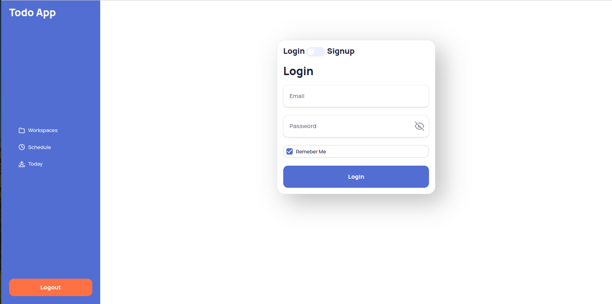
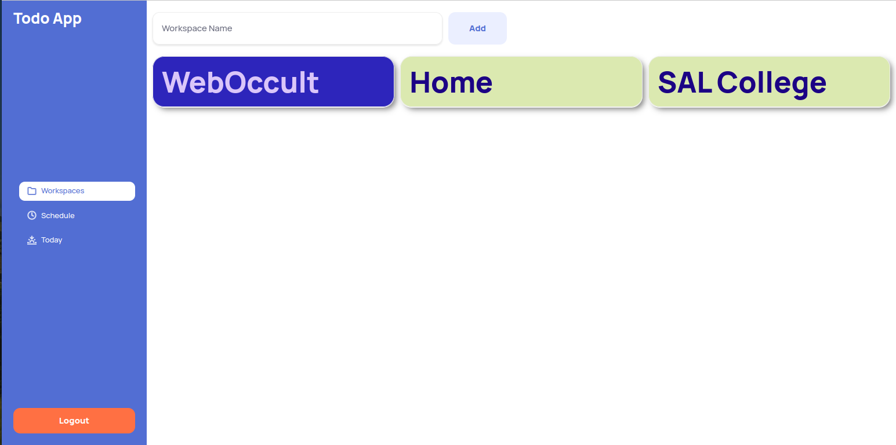
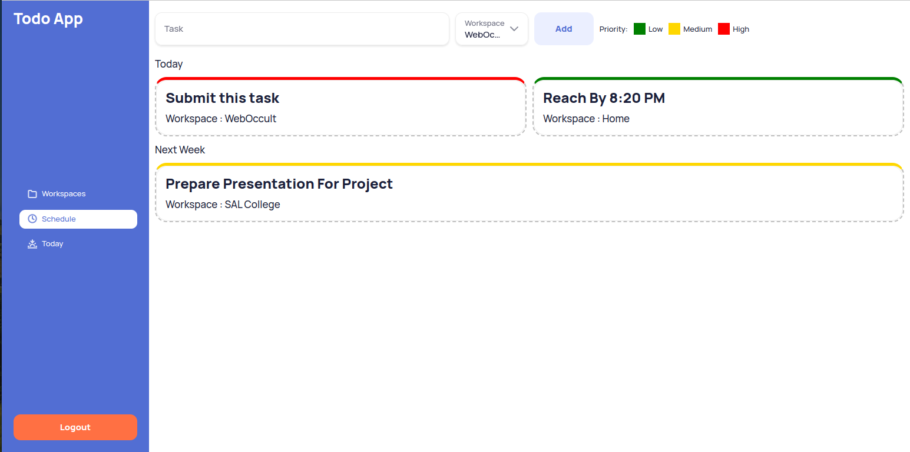
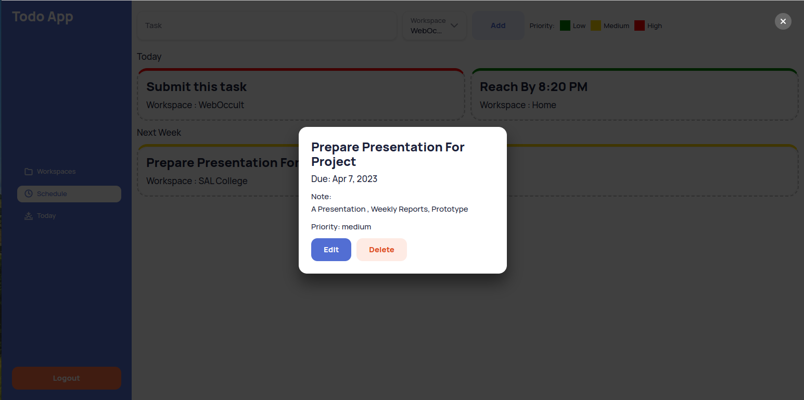
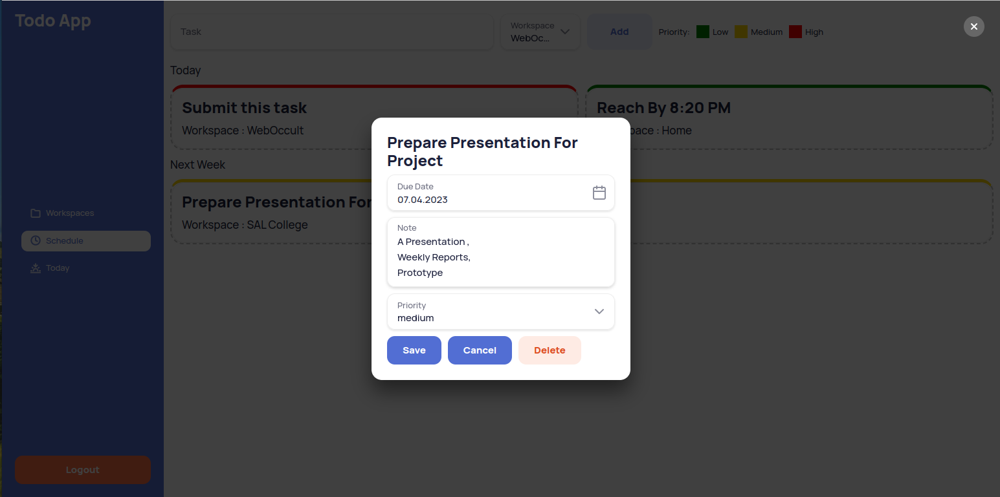

# Angular Task: Todo App

### Task: 
- Create Todo app with multiple workspace
- Each workspace should have their proper id, name and created time/date
- Workspace can have no or many task in them with different dates, title, notes and priority
- User can modify notes, dates, priority or delete task
- Application have 3 routes (List, Schedule and Today's task)
- Each task should have different id, created at, etc. data.
- Data should not be lost after refresh.
- You can use angular material.
- Each workspace will be of different color

### Preview:

